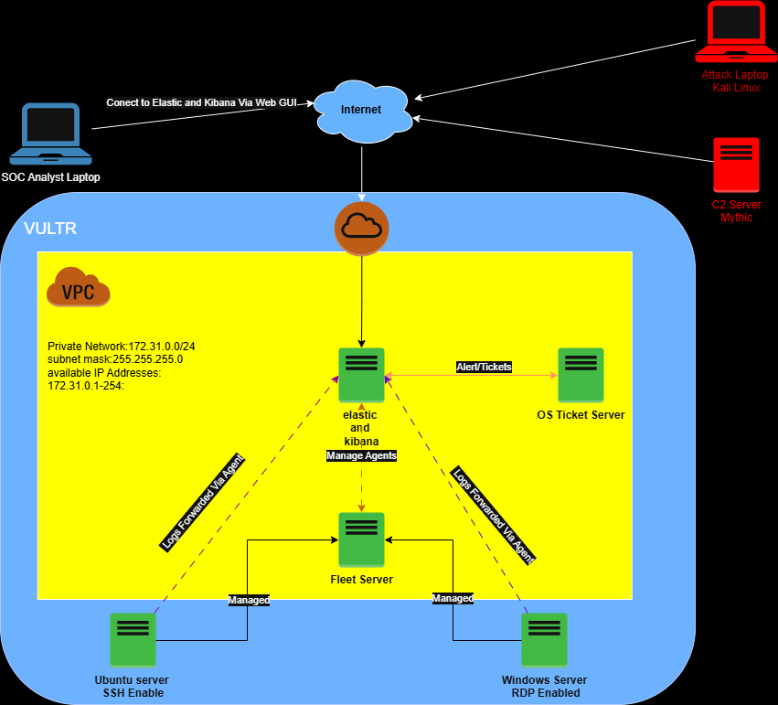
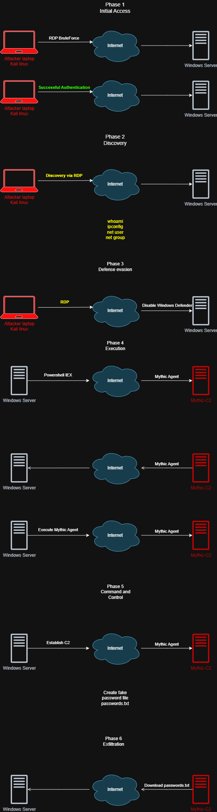

# 🏠 My First SOC Home Lab (Vultr-Based)

This is my first go at building a home SOC (Security Operations Center) lab — hosted entirely on Vultr. It’s a hybrid blue/red team environment where I can mess around with logging, detection, C2 frameworks, and incident tracking. All in the name of learning and leveling up 🔧💻🔐

---

## 🧠 Lab Purpose

The goal of this lab is to:

- Simulate a basic enterprise environment
- Monitor real-time logs using Elastic & Kibana
- Practice threat detection with Elastic Agent + Fleet
- Simulate attacks using Kali + Mythic C2
- Track and manage alerts via osTicket
- Train like a SOC analyst in a safe cloud lab

---

## 🏗️ Lab Infrastructure

### 🌐 Network

- **Private Network:** `172.31.0.0/24`
- **Subnet Mask:** `255.255.255.0`
- **Available IPs:** `172.31.0.1 - 172.31.0.254`

### 🔹 Components

| Role                | OS / App            | Notes                            |
|---------------------|---------------------|----------------------------------|
| Elastic Stack       | Elastic + Kibana    | Main log storage + dashboards    |
| Fleet Server        | Elastic Fleet       | Manages agents across endpoints  |
| Windows Server      | Windows (RDP)       | Simulated endpoint w/ monitoring |
| Ubuntu Server       | Ubuntu (SSH)        | Another endpoint (Linux)         |
| osTicket Server     | osTicket            | For handling alerts/tickets      |
| C2 Server           | Mythic              | Command & control server         |
| Attack Laptop       | Kali Linux          | Red team / offensive side        |
| Analyst Laptop      | Windows             | Used for SOC-level monitoring    |

---

## 🌐 Hosting

All machines are hosted on **[Vultr](https://www.vultr.com/)** using cloud instances.

---

## 🔁 Log Flow

- Logs from endpoints are forwarded via **Elastic Agent**
- Collected by the **Fleet Server**
- Shipped to **Elastic Stack** for analysis and visualization
- Alerts and tickets created in **osTicket**

---

## 🖼️ Lab Architecture Diagram



---

## 🔓 Attack Simulation Flow

This lab includes a simulated attack chain that follows the attacker lifecycle from initial access to exfiltration:

1. **Initial Access** – RDP brute force from Kali to Windows Server  
2. **Discovery** – Using built-in commands like `whoami`, `net user`, etc.  
3. **Defense Evasion** – Disabling Windows Defender  
4. **Execution** – PowerShell IEX to load Mythic agent  
5. **Command & Control** – Persistent access established via Mythic C2  
6. **Exfiltration** – Fake `secret-password.txt` file created and "stolen"



---

## 🛠️ Deployment Phase

Below is the deployment mapping with public and private IPs for each component.

| Component           | Public IP        | Private IP          |
|---------------------|------------------|---------------------|
| Elastic & Kibana    | `95.179.252.168` | `172.31.0.3`        |
| Fleet Server        | `140.82.35.156`  | `172.31.0.4`        |
| Windows Server      | `45.32.154.93`   | `N/A`               |
| Ubuntu Server       | `80.240.23.65`   | `N/A`               |
| osTicket Server     | `x.x.x.x`        | `172.31.x.x`        |
| Mythic C2 Server    | `199.247.23.210` | `N/A`               |

### 🔧 Step 1: Create the Virtual Private Cloud (VPC)

The first step is to create a **VPC (Virtual Private Cloud)** that connects all lab components within a private address space.

- **VPC CIDR Block:** `172.31.0.0/24`
- **Subnet Mask:** `255.255.255.0`
- **Purpose:** Provides internal routing between lab components while still allowing controlled external access (e.g. SSH, RDP, web GUI).
- This VPC is created within Vultr’s platform and serves as the backbone of the lab environment.

  


### 🖥️ Step 2: Deploy Lab Instances

Each virtual machine (VM) or server was deployed on Vultr with the required OS and specifications. All tools were installed by following their official documentation to ensure correct setup and updates.

| Component           | OS / Base Image     | Setup Guide |
|---------------------|---------------------|-------------|
| **Elastic Stack**   | Ubuntu 22.04        | [Elastic Docs](https://www.elastic.co/guide/en/elastic-stack/current/index.html) |
| **Fleet Server**    | Ubuntu 22.04        | [Fleet Server Setup](https://www.elastic.co/guide/en/fleet/current/fleet-server.html) |
| **Windows Server**  | Windows Server 2022 | Manual install + Elastic Agent |
| **Ubuntu Server**   | Ubuntu 22.04        | Manual install + Elastic Agent |
| **osTicket Server** | Windows Server 2022 | [osTicket Docs](https://docs.osticket.com/en/latest/) |
| **Mythic C2**       | Ubuntu 22.04        | [Mythic Docs](https://docs.mythic-c2.net/) |
| **Kali Linux**      | Kali Local VM       | [Kali Linux](https://www.kali.org/get-kali/) |
| **Analyst Laptop**  | Windows 11 (Local)  | No deployment needed (used locally) |

> ⚙️ All installations followed their respective official guides with minimal modifications to ensure compatibility and security.

---

### 📊 Step 3: Create Authentication Dashboards

After deploying and enrolling our Windows and Ubuntu servers into Fleet, we created Kibana dashboards to monitor authentication activity in real time.

#### 👀 What We're Tracking

- **Failed vs successful login attempts**
- **Source IP addresses**
- **Target usernames**
- **Login geolocation** 

#### 🪟 Windows Server (RDP)

- Data source: `winlogbeat` via Elastic Agent
- Visualizing:
  - `event.code: 4624` (Successful login)
  - `event.code: 4625` (Failed login)
  - `user.name` (username that attempted login)
  - `source.ip` (origin of the attempt)
  - Timestamps of login attempts

  ##### 🔍 RDP Failure Detection Query (KQL)

  ```kql
  event.code: 4625 AND agent.name: "My-SOC-Windows-Host" AND message:*mstsc*
  ```
  This filters failed login attempts triggered by the Microsoft RDP client (mstsc.exe) on the host named My-SOC-Windows-Host.

  🧠 Why not filter on LogonType: 10?
  In this lab setup, all failed RDP logins appear as LogonType: 3 instead of 10. This is likely due to how Windows logs pre-authentication RDP handshake failures — especially when using tools like xfreerdp. So     instead, we match on message:*mstsc* to detect RDP login attempts initiated via the Remote Desktop client.

  

  ##### ✅ RDP Success Detection Query (KQL)

```kql
event.code: 4624 AND agent.name: "My-SOC-Windows-Host" AND winlog.event_data.LogonType: 10
```
##### 🗺️ RDP Source IP Map Visualization

We also use  **Kibana Maps**  to display the geographic origin of RDP login attempts.


This map helps visualize suspicious login origins and detect possible brute force attempts from unexpected regions.


##### 📋 RDP Login Table Visualization

A **Data Table** visualization is used to display detailed RDP login activity.

This table gives a clear timeline of who attempted to connect, from where, and whether they were successful.


#### 🐧 Ubuntu Server (SSH)

- Data source: `syslog` via Elastic Agent
- Visualizing:
  - `event.outcome` for success/failure
  - `user.name` (username that attempted login)
  - `source.ip` (origin of the attempt)
  - Timestamps of login attempts

##### 🔍 SSH Failure Detection Query (KQL)

```kql
agent.name :"My-SOC-Ubuntu" and event.category : "authentication"  and event.outcome : "failure" "
```

This query filters failed SSH login attempts on the host named `My-SOC-Ubuntu-Host`.

##### ✅ SSH Success Detection Query (KQL)

```kql
agent.name :"My-SOC-Ubuntu" and event.category : "authentication"  and event.outcome : "success" "
```

This query filters successful SSH login events on the same host.

##### 🗺️ SSH Source IP Map Visualization

We use a **Kibana Maps** visualization to plot geographic origins of SSH login attempts.

This visualization helps identify where login attempts are coming from and spot anomalies.


##### 📋 SSH Login Table Visualization

A **Data Table** visualization gives a clear view into SSH login activity.

The table is useful for quick investigations and spotting brute force patterns or unusual user behavior.


> 🔐 These dashboards provide visibility into brute force attempts, suspicious remote access, and login patterns across the environment.

---
## 🧨 Step 4: Simulate an Attack

This phase demonstrates a red team simulation using Kali Linux and Mythic C2. The attack follows a standard adversary kill chain and is designed to simulate common TTPs (Tactics, Techniques, and Procedures) observed in real-world incidents.

---

### 🔓 Phase 1: Initial Access

- The attacker (Kali) initiates a brute-force attack against the Windows Server over RDP.
- Tools used: `hydra` (for brute-force login) and `xfreerdp` (for interactive session testing).
- A weak password `Winter2024!` was intentionally configured to simulate poor password hygiene.
- After multiple failed attempts, the attacker successfully logs in using valid credentials.

  


---

### 🔍 Phase 2: Discovery

- After gaining access via RDP, the attacker runs built-in commands for enumeration:
  - `whoami`
  - `ipconfig`
  - `net user`, `net group`
- These commands help the attacker gather information about users, network settings, and potential privilege escalation paths.

  


---

### 🛡️ Phase 3: Defense Evasion

- The attacker disables Windows Defender using PowerShell.
- This allows for unrestricted payload execution and simulates real-world bypass techniques.
- Disabling built-in defenses increases persistence and stealth.

  


---

### ⚙️ Phase 4: Execution

- A PowerShell command using `Invoke-Expression (IEX)` is used to execute a remote payload in memory.
- This payload loads a Mythic agent (Apollo) without touching disk, simulating a fileless malware technique.
- The script is obfuscated to avoid signature-based detection.

   

  <br><br>
   


---

### 🛰️ Phase 5: Command & Control (C2)

- The Mythic agent establishes a secure connection to the Mythic C2 server.
- The attacker gains full command-and-control over the compromised Windows Server.
- Actions include issuing tasks, retrieving host info, and preparing for lateral movement.

  


---

### 📤 Phase 6: Exfiltration

- A fake file (`secret-password.txt`) is created on the victim machine to simulate sensitive data.
- This file is exfiltrated through the Mythic agent using its built-in file transfer capabilities.
- Exfiltration happens over the encrypted C2 channel, simulating stealthy data theft.

   


---

## 🕵️ Step 5: Threat Hunting

This phase simulates a real-world blue team scenario where the SOC receives a report from a user — not a detection alert. The hunt begins with minimal context and evolves through investigation and correlation across logs.

---

### 📣 Incident Context

The SOC received a report from a user stating that a suspicious file named `secret-passwords.txt` appeared on their Desktop. No alerts were triggered. The analyst team was tasked with determining what happened, how, and when.

---

### 🗺️ Step 1: Initial Recon — Investigating Login Origins

- We started by reviewing **Kibana Maps** to visualize geographic origins of login attempts.
- RDP login attempts from unusual countries stood out immediately.
- Combined with the RDP login table, we were able to confirm that one of these attempts eventually succeeded — coming from an unfamiliar location.

  

  


---

### 🐚 Step 2: Investigate Remote Command Activity

- We then pivoted to PowerShell and process logs for deeper insight.
- We observed:
  - Use of `Invoke-WebRequest` to download a remote script
  - Followed by `Invoke-Expression (IEX)` to execute the downloaded content
- This strongly indicated **fileless execution of a payload**, likely related to C2 activity.

---

### 🧱 Step 3: Check for AV/EDR Evasion

- Defender logs showed the use of `Set-MpPreference` to disable several protection layers.
- This included real-time monitoring, behavior monitoring, and script scanning.
- This step confirmed that the attacker actively attempted to evade detection.

---

### 📤 Step 4: Confirm Exfiltration Behavior

- Minutes after the script execution, the suspicious file `secret-password.txt` was accessed and copied.
- The process responsible for accessing the file had previously established an HTTPS connection to an external IP.
- This behavior aligned with a typical exfiltration phase in a C2-controlled attack.

---

> 🧠 This threat hunt was conducted manually using Elastic dashboards, Maps, and Discover views. It mirrors how real SOCs triage user-reported incidents with limited initial context and piece together the full story through log correlation.

